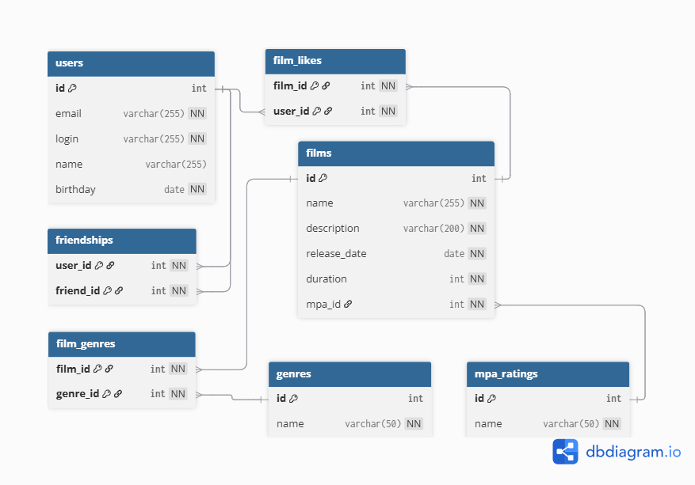

# java-filmorate

Template repository for Filmorate project.


## Описание ER-диаграммы

ER-диаграмма отражает структуру базы данных проекта Filmorate и связи
между основными сущностями приложения.  
База нормализована до третьей нормальной формы (3НФ): каждая таблица
содержит только атомарные значения, данные не дублируются, связи
оформлены через внешние ключи.

---

## Описание структуры базы данных

### Пользователи (`users`)

Содержит данные о пользователях сервиса:

- уникальный идентификатор `id`;
- `email` и `login` (оба уникальны);
- `name` — отображаемое имя;
- `birthday` — дата рождения.

### Фильмы (`films`)

Таблица с основной информацией о фильмах:

- `id`, `name`, `description`, `release_date`, `duration`;
- `mpa_id` — внешний ключ на возрастной рейтинг.

### Рейтинги MPA (`mpa_ratings`)

Справочник возрастных рейтингов:

- G, PG, PG-13, R, NC-17.

### Жанры (`genres`)

Справочник жанров (Комедия, Драма, Триллер, Мультфильм и др.).

### Связь «фильм–жанр» (`film_genres`)

Промежуточная таблица для связи «многие ко многим»:

- один фильм может иметь несколько жанров;
- один жанр может относиться к разным фильмам.

### Лайки фильмов (`film_likes`)

Связь между пользователями и фильмами:

- один пользователь может лайкнуть фильм только один раз (гарантируется составным PK).

### Дружба пользователей (`friendships`)

Хранит статус дружбы между пользователями:

- `PENDING` — заявка отправлена;
- `CONFIRMED` — дружба подтверждена.

---

## Основные запросы к базе данных

### Получить всех пользователей

```sql
SELECT *
FROM users;
```

### Получить все фильмы с рейтингом MPA

```sql
SELECT f.id,
       f.name,
       f.description,
       f.release_date,
       f.duration,
       m.code AS mpa_rating
FROM films f
         JOIN mpa_ratings m ON f.mpa_id = m.id;
```

### Топ N самых популярных фильмов (по количеству лайков)

```sql
SELECT f.id,
       f.name,
       COUNT(fl.user_id) AS likes_count
FROM films f
         LEFT JOIN film_likes fl ON f.id = fl.film_id
GROUP BY f.id, f.name
ORDER BY likes_count DESC LIMIT :count;
```

### Получение друзей пользователя

```sql
SELECT u.*
FROM friendships fs
         JOIN users u ON fs.friend_id = u.id
WHERE fs.user_id = :userId
  AND fs.status = 'CONFIRMED';
```

### Поиск общих друзей двух пользователей

```sql
SELECT u.*
FROM friendships f1
         JOIN friendships f2 ON f1.friend_id = f2.friend_id
         JOIN users u ON u.id = f1.friend_id
WHERE f1.user_id = :userId
  AND f2.user_id = :otherId
  AND f1.status = 'CONFIRMED'
  AND f2.status = 'CONFIRMED';
```